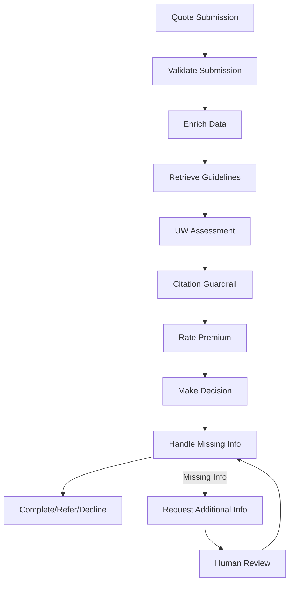

# Agentic Quote-to-Underwrite - System Architecture

> **Note**: This document describes the actual implemented architecture of the Agentic Quote-to-Underwrite system. This is a demonstration project showcasing agentic AI capabilities in insurance underwriting.

## **System Overview**

The Agentic Quote-to-Underwrite system is a **proof-of-concept** that demonstrates how LangGraph workflows and RAG (Retrieval-Augmented Generation) can be used to create intelligent insurance underwriting processes. The system uses real semantic embeddings and evidence-based decision making.

---

## **Architecture Components**

### **Core Technologies**
- **LangGraph**: Workflow orchestration for agent coordination
- **FastAPI**: RESTful API framework for HTTP endpoints
- **ChromaDB**: Vector database for semantic search
- **Sentence Transformers**: Semantic embeddings for document retrieval
- **SQLite**: Local storage for audit trails and run records

### **Agent Workflow System**



### **7 Specialized Agents**

1. **Validation Agent**: Validates input data and required fields
2. **Enrichment Agent**: Normalizes addresses and calculates hazard scores
3. **Retrieval Agent**: Fetches relevant underwriting guidelines via RAG
4. **Assessment Agent**: Performs underwriting assessment with citations
5. **Citation Guardrail**: Ensures decisions have proper evidence
6. **Rating Agent**: Calculates insurance premiums
7. **Decision Agent**: Makes final underwriting decisions

---

## **RAG Implementation**

### **Semantic Search System**
```python
rag_system = {
    "embeddings": "sentence-transformers/all-MiniLM-L6-v2",
    "vector_store": "ChromaDB with semantic indexing",
    "retrieval": "Similarity search with relevance scoring",
    "citations": "Evidence-based decision support"
}
```

### **Document Processing**
- **Underwriting Guidelines**: Semantic indexing of regulatory documents
- **Risk Assessment Rules**: Structured rule retrieval with confidence scores
- **Citation Tracking**: Complete provenance for all decisions

---

## **HITL (Human-in-the-Loop) System**

### **Missing Information Detection**
```python
hitl_workflow = {
    "field_validation": "Required field checking",
    "question_generation": "Dynamic question creation",
    "pause_resume": "Workflow pause for human input",
    "completion_logic": "Resume when info provided"
}
```

### **Human Review Process**
- **Automatic Detection**: Identifies missing required information
- **Question Generation**: Creates specific questions for underwriters
- **Workflow Pause**: Suspends processing until answers provided
- **Resume Logic**: Continues workflow with additional information

---

## **Agent Communication System**

### **Threading Implementation**
```python
agent_communication = {
    "threading": "ThreadPoolExecutor for message processing",
    "message_queues": "Thread-safe queue.Queue() for each agent",
    "handlers": "Asynchronous message processing",
    "coordination": "Inter-agent message passing"
}
```

### **Message Types**
- **REQUEST**: Agent-to-agent requests
- **RESPONSE**: Reply messages with correlation IDs
- **NOTIFICATION**: Status updates and events
- **QUERY**: Information requests

---

## **Data Flow Architecture**

### **Input Processing**
```python
input_flow = {
    "api_endpoint": "POST /quote/run",
    "validation": "Schema validation with Pydantic",
    "enrichment": "Address normalization and hazard scoring",
    "workflow_start": "LangGraph workflow initiation"
}
```

### **Decision Pipeline**
```python
decision_pipeline = {
    "evidence_retrieval": "RAG-based guideline search",
    "assessment": "Multi-factor risk evaluation",
    "citation_check": "Evidence validation guardrail",
    "final_decision": "Accept/Refer/Decline with reasoning"
}
```

---

## **Storage & Persistence**

### **Database Schema**
```python
storage_system = {
    "run_records": "Complete workflow execution history",
    "decisions": "Decision packets with citations",
    "audit_trails": "Full traceability of all actions",
    "message_history": "Agent communication logs"
}
```

### **Data Models**
- **QuoteSubmission**: Input data validation
- **WorkflowState**: Workflow execution state
- **DecisionPacket**: Final decisions with evidence
- **RetrievalChunk**: RAG search results

---

## **API Architecture**

### **Endpoints**
```python
api_endpoints = {
    "POST /quote/run": "Main quote processing endpoint",
    "use_agentic": "Enable HITL and citation guardrails",
    "additional_answers": "Complete missing information workflows",
    "GET /static/index.html": "Demo interface"
}
```

### **Response Format**
```python
response_structure = {
    "run_id": "Unique execution identifier",
    "status": "processing/waiting_for_info/completed",
    "decision": "Accept/Refer/Decline with confidence",
    "citations": "Evidence-based decision support",
    "required_questions": "HITL question generation"
}
```

---

## **Testing Architecture**

### **Test Coverage**
```python
test_suite = {
    "phase_a_scenarios": "10 comprehensive workflow tests",
    "workflow_unit_tests": "Component-level testing",
    "rag_functionality": "Semantic search validation",
    "hitl_demo": "End-to-end HITL workflow testing"
}
```

### **Validation Methods**
- **Scenario Testing**: 10 different underwriting scenarios
- **Unit Testing**: Individual component validation
- **Integration Testing**: End-to-end workflow testing

---

## **Current Implementation Status**

### **Implemented Features** 
- **Real RAG System**: Semantic search with sentence-transformers
- **HITL Workflows**: Pause/resume for missing information
- **Agent Communication**: Threading-based message passing
- **Evidence-Based Decisions**: All decisions backed by citations
- **Comprehensive Testing**: Full test suite with validation

### **Technical Capabilities**
- **Semantic Embeddings**: Real document understanding
- **Workflow Orchestration**: LangGraph-based agent coordination
- **Human-in-the-Loop**: Interactive missing information handling
- **Audit Trails**: Complete decision provenance
- **Thread-Safe Operations**: Concurrent agent processing

---

## **Demo & Testing**

### **Running the System**
```bash
# Start the demo server
python hitl_demo.py

# Run tests
python -m pytest tests/test_phase_a_scenarios.py -v
python -m pytest tests/test_workflows.py -v

# Test RAG functionality
python test_rag_phase1.py
```

### **HITL Demo**
```bash
# Test missing information workflow
curl -X POST "http://localhost:8000/quote/run" \
  -H "Content-Type: application/json" \
  -d '{"submission": {"applicant_name": "John Doe", "address": "123 Main St", "property_type": "single_family", "coverage_amount": 500000}, "use_agentic": true}'
```

---

## **Architecture Principles**

### **Design Philosophy**
- **Evidence-Based**: All decisions backed by verifiable citations
- **Explainable**: Complete audit trails and reasoning
- **Interactive**: Human-in-the-loop for complex cases
- **Modular**: Separate agents for different underwriting tasks
- **Testable**: Comprehensive test coverage

### **Technical Standards**
- **Type Safety**: Pydantic models for data validation
- **Concurrency**: Thread-safe agent communication
- **Persistence**: SQLite for audit trails
- **API Design**: RESTful endpoints with clear contracts

---

## **Conclusion**

The Agentic Quote-to-Underwrite system demonstrates **practical agentic AI capabilities** in insurance underwriting. While this is a **proof-of-concept**, it showcases:

- **Real RAG Implementation**: Semantic search with actual embeddings
- **Working HITL Workflows**: Interactive missing information handling
- **Agent Coordination**: Threading-based message passing
- **Evidence-Based Decisions**: All decisions backed by citations
- **Comprehensive Testing**: Full validation of system capabilities

This system serves as a **technical demonstration** of how modern AI technologies can be applied to traditional insurance workflows, providing a foundation for understanding agentic AI implementation patterns.

---

**Note**: This is a demonstration project for technical interviews and AI engineering showcases. The implementation focuses on demonstrating core concepts rather than production deployment.
