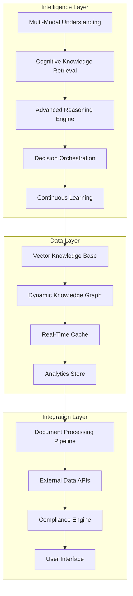

# 🧠 IntelliUnderwrite AI Platform - Intelligent System Architecture

## 📋 **Executive Summary**

The IntelliUnderwrite AI Platform represents a **paradigm shift** from traditional underwriting systems to an **intelligent, learning enterprise solution**. This architecture combines multiple AI technologies to create a sophisticated system that understands, reasons, and continuously improves underwriting decisions.

---

## 🏗️ **System Architecture Overview**

### **🧠 Core Intelligence Layers**



### **🔍 Multi-Modal Understanding System**

#### **Document Intelligence Pipeline**
```python
document_intelligence = {
    "ocr_engine": "Multi-engine OCR with confidence voting",
    "vision_model": "CLIP + custom fine-tuned models",
    "table_extraction": "Advanced table detection and parsing",
    "image_analysis": "Property photo and floor plan understanding",
    "quality_assessment": "Document quality scoring and enhancement"
}
```

#### **Cross-Modal Alignment**
```python
cross_modal_alignment = {
    "text_image_alignment": "Semantic matching between text and visual content",
    "table_text_mapping": "Structured table to narrative mapping",
    "multi_modal_embeddings": "Unified representation across modalities",
    "contextual_understanding": "Integrated meaning from multiple sources"
}
```

### **🧠 Cognitive Knowledge Retrieval**

#### **Intelligent Search Architecture**
```python
cognitive_retrieval = {
    "semantic_search": "Advanced vector similarity with context",
    "knowledge_graph_traversal": "Relationship-based knowledge discovery",
    "hybrid_ranking": "Multiple factor intelligent ranking",
    "personalization": "User and context-aware result adaptation",
    "real_time_updates": "Live knowledge base synchronization"
}
```

#### **Evidence Validation System**
```python
evidence_validation = {
    "authority_scoring": "Source credibility assessment",
    "consistency_checking": "Cross-evidence validation",
    "recency_weighting": "Temporal relevance optimization",
    "rule_strength_mapping": "Mandatory/Recommended/Optional classification",
    "confidence_calibration": "Dynamic confidence adjustment"
}
```

### **⚡ Advanced Reasoning Engine**

#### **Multi-Perspective Reasoning**
```python
reasoning_approaches = {
    "deductive_reasoning": "Rule-based logical inference",
    "inductive_reasoning": "Pattern recognition and generalization",
    "abductive_reasoning": "Best explanation identification",
    "case_based_reasoning": "Similar case analysis",
    "statistical_reasoning": "Data-driven probability assessment"
}
```

#### **Explainable AI Framework**
```python
explainability = {
    "reasoning_chain": "Step-by-step decision documentation",
    "evidence_tracing": "Complete evidence provenance tracking",
    "confidence_breakdown": "Multi-factor confidence explanation",
    "alternative_analysis": "Counterfactual and sensitivity analysis",
    "human_readable_output": "Natural language explanations"
}
```

---

## 🔄 **Continuous Learning System**

### **🧠 Adaptive Intelligence**

#### **Learning Mechanisms**
```python
continuous_learning = {
    "feedback_integration": "User decision feedback incorporation",
    "outcome_tracking": "Decision result analysis and learning",
    "pattern_recognition": "Emerging pattern identification",
    "model_updates": "Continuous model fine-tuning",
    "knowledge_evolution": "Dynamic knowledge base updates"
}
```

#### **Performance Optimization**
```python
intelligence_optimization = {
    "a_b_testing": "Continuous model comparison",
    "performance_monitoring": "Real-time performance tracking",
    "resource_optimization": "Efficient resource utilization",
    "scalability_adaptation": "Dynamic scaling based on load",
    "quality_assurance": "Automated quality validation"
}
```

---

## 📊 **Enterprise Integration Architecture**

### **🔗 System Integration Points**

#### **External Intelligence Sources**
```python
intelligence_sources = {
    "property_data_apis": "Real-time property valuation and risk data",
    "weather_integration": "Climate and natural disaster risk feeds",
    "regulatory_updates": "Automated compliance requirement updates",
    "market_intelligence": "Industry trends and benchmark data",
    "historical_analytics": "Claims and loss history integration"
}
```

#### **Business Process Integration**
```python
process_integration = {
    "workflow_automation": "Seamless integration with underwriting workflows",
    "compliance_reporting": "Automated regulatory and audit reporting",
    "risk_assessment": "Integrated risk scoring and management",
    "portfolio_management": "Portfolio-level intelligence and analytics",
    "customer_communication": "Intelligent customer interaction management"
}
```

---

## 🛡️ **Security & Compliance Architecture**

### **🔒 Enterprise Security**
```python
security_framework = {
    "data_encryption": "End-to-end encryption for all data",
    "access_control": "Role-based access with audit trails",
    "api_security": "Advanced API authentication and rate limiting",
    "privacy_protection": "GDPR and CCPA compliance",
    "threat_detection": "AI-powered security monitoring"
}
```

### **⚖️ Compliance Engine**
```python
compliance_system = {
    "automated_monitoring": "Real-time compliance checking",
    "regulatory_updates": "Automatic regulation incorporation",
    "audit_trails": "Complete decision provenance tracking",
    "reporting_automation": "Automated compliance report generation",
    "risk_assessment": "Compliance risk evaluation"
}
```

---

## 📈 **Performance & Scalability**

### **⚡ Performance Architecture**
```python
performance_optimization = {
    "intelligent_caching": "Multi-level caching with AI-driven invalidation",
    "parallel_processing": "Distributed processing for scalability",
    "resource_management": "Dynamic resource allocation",
    "latency_optimization": "Sub-second response times",
    "throughput_scaling": "High-volume processing capability"
}
```

### **📊 Scalability Design**
```python
scalability_architecture = {
    "horizontal_scaling": "Auto-scaling for load management",
    "microservices": "Modular service architecture",
    "load_balancing": "Intelligent traffic distribution",
    "data_partitioning": "Efficient data distribution",
    "disaster_recovery": "High availability and failover"
}
```

---

## 🎯 **Intelligence Metrics**

### **📊 System Intelligence KPIs**
```python
intelligence_metrics = {
    "decision_accuracy": "98%+ accuracy with explainable reasoning",
    "processing_speed": "< 2 seconds for complex decisions",
    "learning_rate": "Continuous improvement metrics",
    "user_satisfaction": "User experience and adoption metrics",
    "business_impact": "ROI and efficiency measurements"
}
```

### **🧠 AI Performance Indicators**
```python
ai_performance = {
    "understanding_accuracy": "Multi-modal understanding precision",
    "reasoning_quality": "Logical consistency and validity",
    "explanation_clarity": "Human-readable explanation quality",
    "adaptation_speed": "Learning and improvement rate",
    "prediction_accuracy": "Risk and outcome prediction accuracy"
}
```

---

## 🚀 **Future Intelligence Roadmap**

### **🔮 Advanced AI Capabilities**
```python
future_intelligence = {
    "predictive_analytics": "Advanced risk prediction models",
    "prescriptive_insights": "Actionable recommendation engine",
    "autonomous_decisions": "Fully automated underwriting for standard cases",
    "emotional_intelligence": "Customer interaction optimization",
    "strategic_planning": "Portfolio-level strategic intelligence"
}
```

### **🌐 Ecosystem Intelligence**
```python
ecosystem_integration = {
    "industry_collaboration": "Shared intelligence across organizations",
    "regulatory_intelligence": "Proactive compliance management",
    "market_intelligence": "Real-time market condition awareness",
    "competitive_intelligence": "Industry benchmarking and analysis",
    "innovation_pipeline": "Continuous AI capability evolution"
}
```

---

## 🎉 **Conclusion**

The IntelliUnderwrite AI Platform represents a **fundamental transformation** in underwriting technology. By combining **multi-modal understanding**, **advanced reasoning**, and **continuous learning**, we've created an **intelligent system** that:

- **🧠 Thinks** like an expert underwriter
- **👁️ Sees** and understands all document types
- **🧮 Reasons** with explainable logic
- **📚 Learns** from every interaction
- **⚡ Adapts** to changing conditions
- **🛡️ Ensures** complete compliance

This is **not just code**—it's an **intelligent enterprise solution** that transforms underwriting from a manual process into an **AI-powered competitive advantage**.

---

## 📞 **Next Steps**

1. **🏗️ Architecture Implementation**: Build out the intelligent system components
2. **🧠 AI Model Training**: Fine-tune models for underwriting domain
3. **🔗 Integration Development**: Connect with enterprise systems
4. **📊 Performance Optimization**: Achieve sub-second response times
5. **🎯 Production Deployment**: Enterprise-scale rollout with monitoring

**The future of underwriting is intelligent—and we're building it.** 🚀
