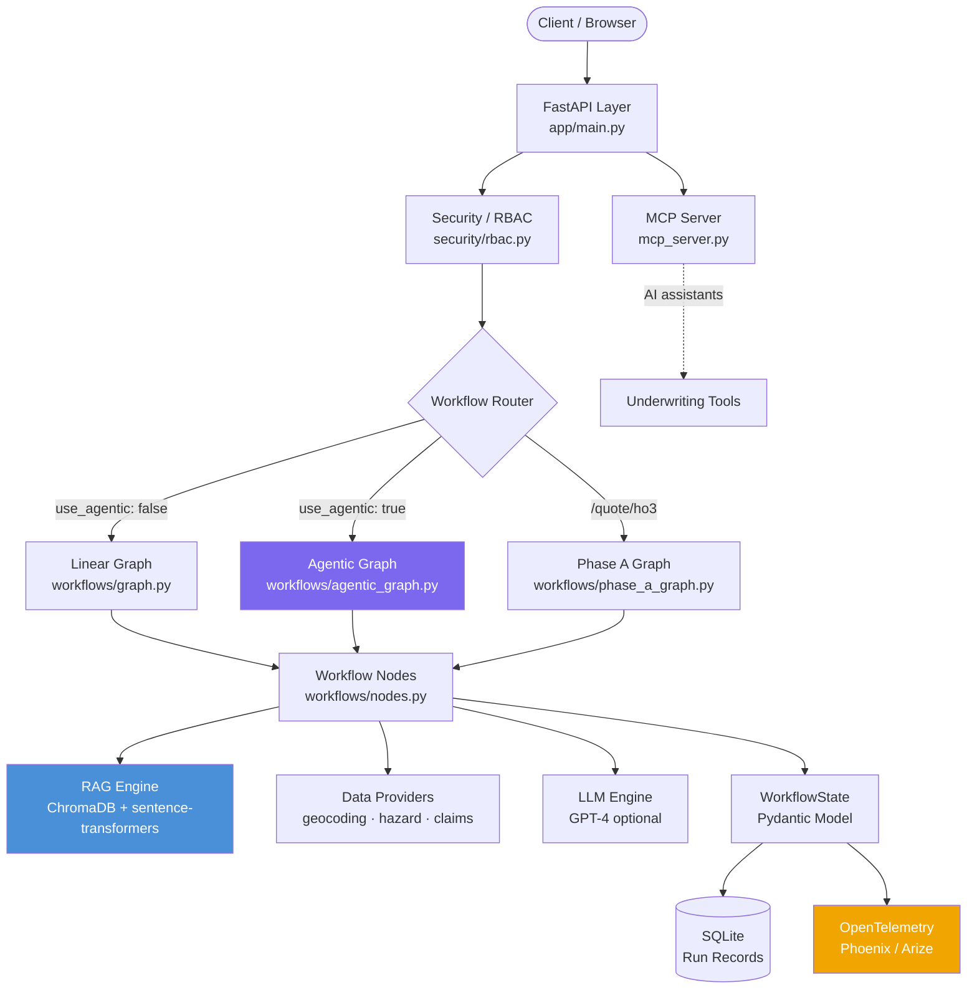
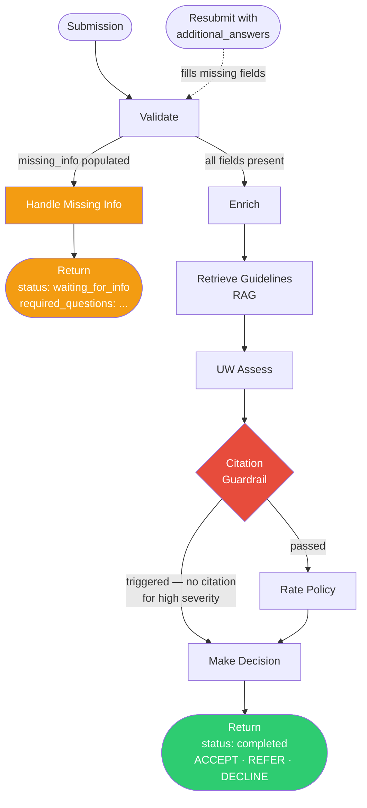
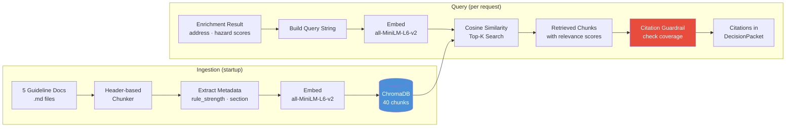
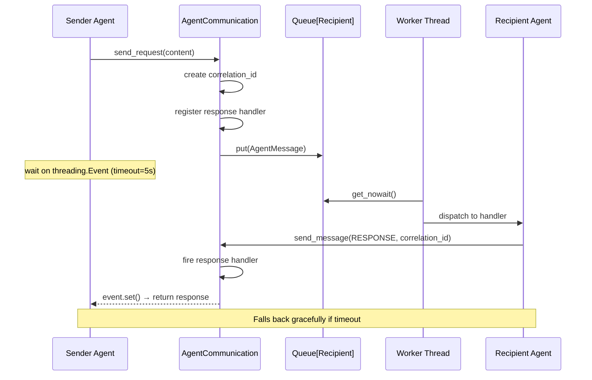
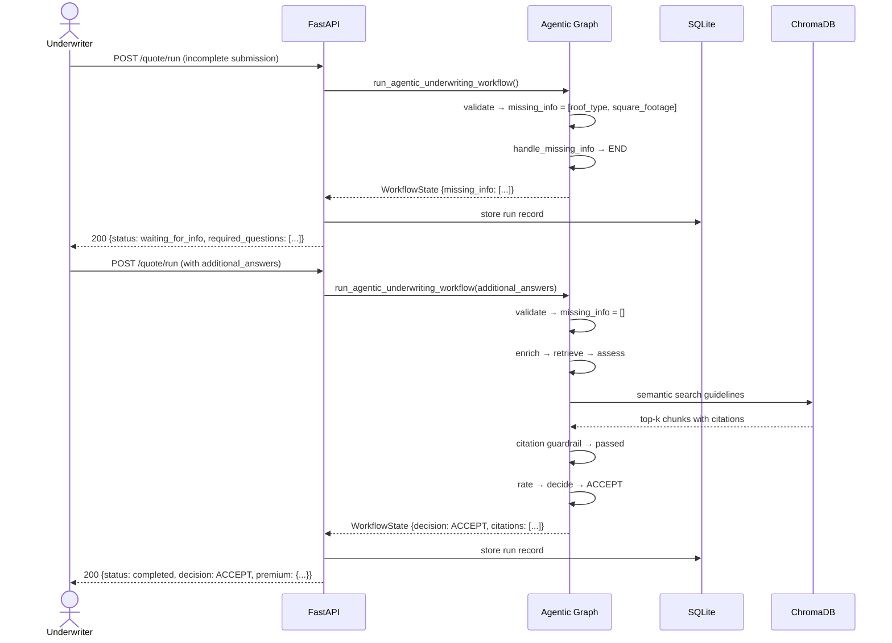

# Agentic Quote-to-Underwrite Workflow (Work in Progress)

An agentic insurance quote processing and underwriting system built with LangGraph, FastAPI, and RAG. This production-ready platform demonstrates how intelligent agents can transform complex insurance workflows into automated, evidence-driven decision-making processes.

## 🎯 **Key Capabilities**

- **🔄 Multi-Step Workflow Orchestration**: Simplifies complex underwriting processes through intelligent agent coordination
- **🛠️ Tool Integration**: Seamlessly combines multiple APIs and services (address validation, hazard scoring, rating engines) to complete end-to-end quote processing
- **🧠 Intelligent Decision Making**: Handles missing information automatically and provides evidence-based decisions with RAG-powered citations
- **🔍 Evidence-Based Underwriting**: Every decision is backed by verifiable guidelines and regulatory requirements
- **⚡ Real-Time Processing**: Production-grade performance with comprehensive audit trails

## 🚀 **Agent Intelligence Demo**

This system serves as a comprehensive demonstration of building sophisticated agentic systems that can:

- **Scale Complexity**: Handle increasingly intricate insurance workflows while maintaining accuracy
- **Adapt and Learn**: Process edge cases and exceptions through intelligent reasoning
- **Ensure Compliance**: Maintain regulatory adherence through automated citation tracking
- **Provide Transparency**: Full audit trails for every decision and recommendation


## ✅ Features Implemented

### Core Infrastructure
- **Schema Definitions**: Complete data models for quotes, assessments, and decisions
- **Tool Stubs**: Address normalization, hazard scoring, and rating tools
- **RAG System**: Document ingestion and retrieval over underwriting guidelines
- **LangGraph Workflow**: Linear processing pipeline (Validate → Enrich → Retrieve → Assess → Rate → Decide)
- **Storage**: SQLite database for run records and audit trails
- **API Endpoints**: RESTful API for quote processing

### Agentic Enhancements ✅
- **Missing-info Loop**: Agentic behavior for handling incomplete submissions
- **Strict Citation Guardrail**: Forces REFER when assessment lacks proper citations
- **Simple UI**: Demo interface for testing and visualization
- **Enhanced Audit Trail**: Complete tool call traceability and run history

## 🏗️ Architecture

```
┌─────────────────┐    ┌──────────────────┐    ┌─────────────────┐
│   FastAPI       │    │   LangGraph      │    │   Storage       │
│   Endpoints     │───▶│   Workflow       │───▶│   SQLite DB     │
└─────────────────┘    └──────────────────┘    └─────────────────┘
                                │
                                ▼
                       ┌──────────────────┐
                       │   RAG Engine     │
                       │   (ChromaDB)     │
                       └──────────────────┘
```

## 🚀 Quick Start

### 1. Automated Setup

```bash
# Clone and navigate to the project
cd AgenticQuote

# Run the setup script
python setup.py
```

The setup script will:
- Install all dependencies
- Create necessary directories
- Initialize the RAG system with guideline documents
- Test the workflow

### 2. Manual Setup

```bash
# Install dependencies
pip install -r requirements.txt

# Create directories
mkdir -p storage storage/chroma_db

# Initialize RAG (optional - done automatically on first run)
python -c "from app.rag_engine import RAGEngine; RAGEngine().ingest_documents()"
```

### 3. Run the Application

```bash
# Start the API server
python -m app.main
```

The API will be available at `http://localhost:8000`

### 4. Access the UI

Open your browser to: `http://localhost:8000/static/index.html`

## 🧪 Testing

### Automated Testing
```bash
# Run core functionality tests
python -m pytest tests/test_phase_a_scenarios.py -v
python -m pytest tests/test_workflows.py -v
python test_rag_phase1.py
```

### Manual Testing with curl
```bash
# Submit a quote for processing (agentic mode)
curl -X POST "http://localhost:8000/quote/run" \
  -H "Content-Type: application/json" \
  -d '{
    "submission": {
      "applicant_name": "John Doe",
      "address": "123 Main St, Los Angeles, CA 90210",
      "property_type": "single_family",
      "coverage_amount": 500000,
      "construction_year": 1985,
      "square_footage": 2000,
      "roof_type": "asphalt_shingle",
      "foundation_type": "concrete"
    },
    "use_agentic": true
  }'

# Submit a quote for processing with missing info to trigger HITL
curl -X POST "http://localhost:8000/quote/run" \
  -H "Content-Type: application/json" \
  -d '{
    "submission": {
      "applicant_name": "John Doe",
      "address": "123 Main St, Los Angeles, CA 90210",
      "property_type": "single_family",
      "coverage_amount": 500000
    },
    "use_agentic": true
  }'

# Submit additional information to complete HITL workflow
curl -X POST "http://localhost:8000/quote/run" \
  -H "Content-Type: application/json" \
  -d '{
    "submission": {
      "applicant_name": "John Doe",
      "address": "123 Main St, Los Angeles, CA 90210",
      "property_type": "single_family",
      "coverage_amount": 500000
    },
    "use_agentic": true,
    "additional_answers": {
      "roof_age_years": "15",
      "construction_type": "frame",
      "occupancy_type": "owner_occupied_primary"
    }
  }'
```

## 📚 API Documentation

### Core Endpoints

#### Processing
- `POST /quote/run` - Process a quote submission
  - `use_agentic: true` enables missing-info loops and citation guardrails
  - **Human-in-the-Loop**: Automatically detects missing information and requests clarification from underwriters
  - **Interactive Workflow**: Continues processing once additional information is provided
- `GET /runs/{run_id}` - Get run status and results
- `GET /runs/{run_id}/audit` - Get full audit trail with tool calls

#### Management
- `GET /runs` - List recent runs
- `GET /stats` - Get system statistics
- `GET /health` - Health check
- `GET /docs` - Interactive API documentation

## 🔄 Human-in-the-Loop(HITL) Workflow

### **Missing Information Detection**
When `use_agentic: true`, the system automatically identifies incomplete submissions and:

1. **🔍 Analyzes Gaps**: Detects missing property details, documentation, or risk factors
2. **❓ Generates Questions**: Creates specific questions for underwriters to answer
3. **⏸️ Pauses Processing**: Holds workflow until additional information is provided
4. **🔄 Resumes Execution**: Continues with enriched data once questions are answered

### **Example Use Case**
```bash
# Initial submission with missing roof age
curl -X POST http://localhost:8000/quote/run -d '{
  "submission": {
    "applicant_name": "John Doe",
    "address": "123 Main St",
    "property_type": "single_family",
    "coverage_amount": 500000,
    "construction_year": 1985
    # Missing: roof_type, foundation_type
  },
  "use_agentic": true
}'

# Response includes required questions
{
  "run_id": "abc123",
  "status": "waiting_for_info",
  "required_questions": [
    {
      "question": "What is the roof type and age?",
      "description": "Required for risk assessment",
      "options": ["asphalt_shingle", "metal", "tile"]
    },
    {
      "question": "What is the foundation type?",
      "description": "Required for structural evaluation",
      "options": ["concrete", "crawl_space", "basement"]
    }
  ]
}

# Continue with additional answers
curl -X POST http://localhost:8000/quote/run -d '{
  "submission": {
    "applicant_name": "John Doe",
    "address": "123 Main St",
    "property_type": "single_family",
    "coverage_amount": 500000,
    "construction_year": 1985,
    "roof_type": "asphalt_shingle",
    "foundation_type": "concrete"
  },
  "use_agentic": true,
  "additional_answers": {
    "roof_type": "asphalt_shingle",
    "roof_age": "15 years",
    "foundation_type": "concrete"
  }
}'
```

## 🔄 Workflow Nodes

1. **Validate**: Check submission completeness and basic requirements
2. **Enrich**: Normalize address and calculate hazard scores
3. **RetrieveGuidelines**: Fetch relevant underwriting guidelines via RAG
4. **UWAssess**: Perform underwriting assessment with citations
5. **CitationGuardrail**: Ensure decisions have proper evidence
6. **Rate**: Calculate insurance premium
7. **Decide**: Make final decision (Accept/Refer/Decline)
8. **HandleMissingInfo**: Agentic loop for incomplete submissions

---

##  **Documentation**

### **Architecture**
- [System Architecture](INTELLIGENT_SYSTEM_ARCHITECTURE.md) *(Actual Implementation)*

---

##  **Technical Implementation**

### **Core Technologies**
- **LangGraph**: Workflow orchestration and agent coordination
- **FastAPI**: RESTful API framework
- **ChromaDB**: Vector database for RAG functionality
- **SQLite**: Local storage for audit trails
- **Sentence Transformers**: Semantic embeddings for document retrieval

### **Key Components**
- **7 Specialized Agents**: Each handling specific underwriting tasks
- **RAG Engine**: Evidence-based decision support
- **HITL Workflow**: Human-in-the-loop for complex cases
- **Citation Guardrail**: Ensures evidence-based decisions
- **Audit Trail**: Complete decision traceability

---

##  **Current Status**

This is a **demonstration project** showcasing agentic AI capabilities in insurance underwriting. The system demonstrates:

- **Real RAG Integration**: Semantic search over underwriting guidelines
- **HITL Workflows**: Pause/resume for missing information
- **Evidence-Based Decisions**: All decisions backed by citations
- **Comprehensive Testing**: Full test suite for validation

**Note**: This is a proof-of-concept for AI engineering interviews and technical demonstrations.

---

## **📊 System Diagrams**

### **1. System Architecture Overview**



### **2. Linear Underwriting Workflow**


### **3. Agentic HITL Workflow**



### **4. RAG Pipeline**



### **5. 7-Agent Contract Architecture**


### **6. Agent Communication (Threading)**



### **7. End-to-End HITL Sequence**



### **8. Data Model**

```mermaid
erDiagram
    QuoteSubmission ||--|| WorkflowState : "drives"
    WorkflowState ||--o| EnrichmentResult : has
    WorkflowState ||--o| UWAssessment : has
    WorkflowState ||--o| Decision : has
    WorkflowState ||--o| PremiumBreakdown : has
    WorkflowState ||--o{ RetrievalChunk : "retrieved_guidelines"}
    WorkflowState ||--o{ ToolCall : "audit trail"

    Decision ||--o{ UWQuestion : "required_questions"}
    UWAssessment ||--o{ RiskTrigger : triggers

    RunRecord ||--|| WorkflowState : stores
    RunRecord {
        string run_id PK
        datetime created_at
        string status
        json node_outputs
    }

    Decision {
        enum decision "ACCEPT|REFER|DECLINE"
        float confidence
        string rationale
        list citations
        list next_steps
    }

    PremiumBreakdown {
        float base_premium
        float hazard_surcharge
        float total_premium
        json rating_factors
    }
```

---

**These 8 diagrams cover the full system architecture and workflows. Paste any of them directly into GitHub README, Notion, or any Markdown renderer that supports Mermaid — they'll render inline.**

---

**Agentic Quote-to-Underwrite - Intelligent Insurance Processing**

For questions or issues, check the audit logs and API documentation.