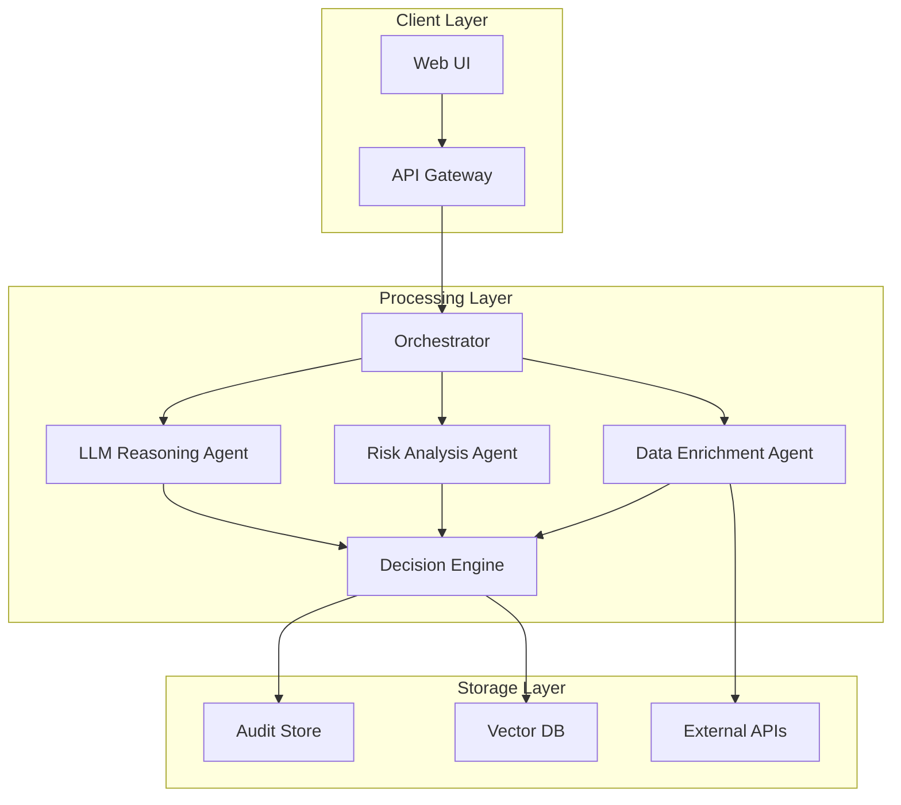

# Agentic Underwriting Platform

A production-style, real-time underwriting system that combines deterministic rules with LLM-based reasoning to deliver **explainable Accept / Refer / Decline decisions**.

Designed for **low-latency, high-throughput workflows** with full auditability and failure resilience.

---

## 🚀 Why This System Exists

Modern underwriting systems face three core challenges:

* External data sources are **inconsistent and unreliable**
* Rules alone are **too rigid for edge cases**
* LLMs are **powerful but non-deterministic**

This system explores a hybrid approach:

> Deterministic rules for correctness + LLM reasoning for flexibility + strong guardrails for reliability

---

## 🧭 System Overview

End-to-end request flow:

Client → API Gateway → Orchestrator → Agents → Decision Engine → Audit Store



---

## 🏗️ Architecture

### Dual Workflow System

The system implements two distinct workflows for different use cases:

#### **Phase A: 7-Agent Production System**

**IntakeNormalizerAgent**
- Validates and canonicalizes HO3 submission data
- Enforces structured schema requirements
- Identifies missing required fields

**PlannerRouterAgent** 
- Determines enrichment strategy based on submission
- Routes to appropriate external data providers
- Optimizes API call sequences

**EnrichmentAgent**
- Geocoding and property data retrieval
- Hazard score calculation (wildfire, flood, earthquake)
- Claims history and neighborhood analysis

**RetrievalAgent**
- RAG-based guideline search using ChromaDB
- Semantic similarity matching with citations
- Evidence chunk retrieval with relevance scoring

**UnderwritingAssessorAgent**
- Eligibility rule evaluation
- Risk trigger identification
- Confidence score calculation

**VerifierGuardrailAgent**
- Citation coverage validation
- High-severity trigger enforcement
- Evidence completeness verification

**DecisionPackagerAgent**
- Final decision assembly (ACCEPT/REFER/DECLINE)
- Premium calculation and rating
- Audit trail compilation

#### **Phase B: Legacy LangGraph Workflow**

**Linear Processing Chain**
- validate → enrich → retrieve_guidelines → assess → decide
- Human-in-the-loop for missing information
- Backward compatibility with existing integrations

### Core Infrastructure

**API Gateway**

* Handles request validation, authentication, and rate limiting
* Ensures idempotency for repeated requests
* FastAPI-based with structured error handling

**Message Queue System**

* Redis-based asynchronous processing
* Priority-based message ordering
* Circuit breaker patterns for external APIs

**Vector Database**

* ChromaDB for semantic search and retrieval
* Sentence Transformers embeddings (all-MiniLM-L6-v2)
* Real-time evidence citation with relevance scores

**Audit Service**

* SQLite database for decision trace storage
* Complete workflow state persistence
* HITL task management and tracking

---

## ⚙️ Key Design Principles

### 1. Determinism First

LLMs are never the sole decision-maker. All decisions pass through a deterministic validation layer.

### 2. Guarded LLM Usage

* Timeout enforced (2 seconds max)
* Confidence threshold required (0.85 minimum)
* Fallback to rules if uncertain

### 3. Canonical Data Model

All external provider data is normalized into unified schemas before processing.

### 4. Idempotent APIs

Repeated requests produce consistent results using request IDs and caching.

### 5. Failure Isolation

Each component is independently recoverable to prevent cascading failures.

---

## 🎯 Design Tradeoffs

### LangGraph vs Custom Orchestrator
**Chose**: LangGraph
**Why**: 
- Built-in state management and visualization
- Proven for agentic workflows
- Faster iteration (2 weeks vs 6 weeks custom)
**Tradeoff**: Vendor lock-in, less control over execution details

### Redis Queue vs Kafka
**Chose**: Redis
**Why**:
- Simpler ops for single-region deployment
- Lower memory footprint
- Sufficient for current throughput (1K req/sec)
**Tradeoff**: Limited replay capabilities, no cross-region replication

### RAG vs Rules-Only
**Chose**: Hybrid (RAG + Rules)
**Why**:
- Rules handle 80% of cases deterministically
- RAG handles edge cases and regulatory changes
- Explainability through evidence citations
**Tradeoff**: Increased complexity, embedding model maintenance

### SQLite vs PostgreSQL
**Chose**: SQLite
**Why**:
- Zero operational overhead
- Sufficient for audit trail storage
- Easy local development
**Tradeoff**: Limited concurrency, no horizontal scaling

---

## 🔄 Request Lifecycle

### Phase A: 7-Agent Workflow

1. **Intake Normalization**: HO3 schema validation and canonicalization
2. **Planning & Routing**: Enrichment strategy determination
3. **Data Enrichment**: External API integration (geocoding, hazard scores)
4. **Guideline Retrieval**: RAG search with evidence citations
5. **Underwriting Assessment**: Risk analysis and trigger identification
6. **Verification Guardrail**: Citation coverage validation
7. **Decision Packaging**: Final decision with premium calculation
8. **Audit Storage**: Complete trace with HITL task tracking

### Phase B: Legacy Workflow

1. **Client Request**: Simple quote submission via API
2. **Validation**: Input completeness and basic checks
3. **Enrichment**: External data (geocoding, hazard scores)
4. **Retrieval**: RAG search for relevant guidelines
5. **Assessment**: Risk analysis and trigger identification
6. **Decision**: Final Accept/Refer/Decline with reasoning
7. **Audit**: Full trace storage for compliance

### HITL (Human-in-the-Loop) Flow

- **Missing Info Detection**: Automatic identification of required fields
- **Task Creation**: HITL task generation with priority
- **Human Review**: Underwriter interface for additional information
- **Workflow Resumption**: Continue processing with provided data
- **Final Decision**: Complete underwriting determination

---

## 📡 API Contract

### Dual Workflow Architecture

The system supports two distinct workflows:

#### **Phase A: 7-Agent System** (Production)
**POST /quote/ho3** - Structured HO3 underwriting with specialized agents

**Request**:
```json
{
  "applicant": {
    "full_name": "John Doe",
    "birth_date": "1980-01-01"
  },
  "risk": {
    "property_address": "123 Main St, Fremont, CA 94536",
    "property_type": "single_family",
    "year_built": 1972,
    "square_footage": 1800,
    "roof_type": "asphalt_shingle"
  },
  "coverage_request": {
    "coverage_amount": 500000,
    "deductible": 1000
  }
}
```

#### **Phase B: Legacy Workflow** (Compatibility)
**POST /quote/run** - Simple quote submission with LangGraph workflow

**Request**:
```json
{
  "applicant_name": "John Doe",
  "address": "123 Main St, Fremont, CA 94536",
  "property_type": "single_family",
  "coverage_amount": 500000,
  "construction_year": 1972,
  "square_footage": 1800,
  "roof_type": "asphalt_shingle",
  "use_agentic": true
}
```

#### **HITL Continuation**
**POST /quotes/{run_id}/resume** - Resume workflow with additional information

**Request**:
```json
{
  "additional_answers": {
    "roof_type": "asphalt_shingle",
    "square_footage": 1800
  }
}
```

### Response Format (Both Workflows)
```json
{
  "run_id": "abc123-def456",
  "status": "completed",
  "decision": {
    "decision": "ACCEPT",
    "confidence": 0.87,
    "reasoning": "Property meets all eligibility criteria"
  },
  "premium": {
    "annual_premium": 1200.00,
    "monthly_premium": 100.00
  },
  "citations": [
    {
      "doc_title": "Underwriting Guidelines",
      "text": "Properties with wildfire risk < 0.3 are eligible",
      "relevance_score": 0.92
    }
  ],
  "requires_human_review": false
}
```

---

## �️ LLM Reliability & Guardrails

### Confidence Thresholds
- **Minimum confidence**: 0.85 for LLM decisions
- **Fallback trigger**: Below 0.85 → deterministic rules
- **Timeout enforcement**: 2 seconds max per LLM call

### Failure Modes & Handling
| Failure Type | Detection | Response |
|-------------|-----------|----------|
| LLM timeout | 2s limit exceeded | Use cached decision + refer |
| Low confidence | Score < 0.85 | Apply conservative rules |
| API rate limit | 429 response | Circuit breaker + degrade |
| Invalid JSON | Schema validation | Retry with simplified prompt |

### Deterministic Safety Net
All LLM outputs pass through:
1. Schema validation (Pydantic models)
2. Business rule validation (hard limits)
3. Compliance check (regulatory constraints)

---

## 📊 Scaling Strategy

* **Horizontal scaling**: Stateless services via load balancer
* **Caching layer**: External API responses cached (Redis)
* **Async processing**: Non-critical enrichment via message queue
* **Load shedding**: Queue requests > 1000/second
* **Graceful degradation**: Disable LLM for >2s latency

---

## ⚠️ Failure Handling

| Scenario | Behavior |
|----------|----------|
| External API timeout | Use cached/default data |
| LLM latency spike | Timeout + fallback to rules |
| Partial data failure | Continue with degraded decision |
| High error rate | Circuit breaker activated |
| Database unavailable | In-memory cache + manual review |

---

## 🚨 Operations Runbook

### Incident Response

**High Error Rate (>5%)**
1. Check external API health (Verisk, geocoding)
2. Verify Redis connectivity
3. Review LLM response times
4. Enable degraded mode if needed

**LLM Performance Degradation**
1. Monitor confidence scores trend
2. Check embedding model version
3. Review prompt templates for drift
4. Fall back to rules-only mode

### Debugging Steps

**Decision Investigation**
```bash
# Trace decision flow
curl "http://localhost:8000/runs/{run_id}"

# Check recent runs
curl "http://localhost:8000/runs?limit=10"

# Verify system health
curl "http://localhost:8000/health"
```

**Log Analysis**
```bash
# Follow decision logs
tail -f logs/underwriting_$(date +%Y%m%d).log

# Check LLM confidence
grep "confidence" logs/underwriting.log | tail -10

# Monitor error rates
grep "ERROR" logs/underwriting.log | wc -l
```

### System Behavior Under Stress

- **Queue overflow**: Requests queued with priority ordering
- **Circuit breakers**: 5 failures → 30 second timeout
- **Memory pressure**: Disable non-critical features
- **Disk space**: Rotate logs, archive old runs

---

## 📁 Repo Structure

```
├── app/                          # Core application logic
│   ├── complete.py              # Main FastAPI application
│   ├── main.py                  # API endpoints
│   ├── rag_engine.py            # RAG implementation
│   ├── llm_engine.py            # LLM integration
│   ├── redis_queue.py           # Message queue
│   ├── cognitive_engine.py      # Advanced reasoning
│   └── api_canonical.py         # Phase A API endpoints
├── workflows/                    # Workflow orchestration
│   ├── agentic_graph.py         # Legacy LangGraph workflow
│   ├── phase_a_graph.py         # 7-agent production workflow
│   └── nodes.py                 # Individual workflow nodes
├── models/                       # Data models and schemas
│   ├── schemas.py               # Pydantic models (HO3Submission, etc.)
│   └── database.py              # Database models
├── storage/                      # Database operations
│   └── database.py              # SQLite database layer
├── tools/                        # External API integrations
│   ├── mock_providers.py        # Mock provider implementations
│   └── provider_gateway.py      # Provider abstraction layer
├── providers/                    # Real provider implementations
│   ├── property_data_provider.py
│   ├── hazard_data_provider.py
│   └── claims_data_provider.py
├── agents/                       # Phase A agent implementations
│   ├── collaboration.py          # Agent communication
│   └── workflows.py              # Agent workflow management
├── static/                       # Frontend assets
│   ├── index.html               # Main web interface
│   ├── css/                     # Stylesheets
│   └── js/                      # JavaScript
├── tests/                        # Test suite
│   ├── demo_scenarios.py        # Test scenarios
│   ├── test_phase_a_scenarios.py
│   └── test_single_scenario.py
├── k8s/                          # Kubernetes configurations
├── docs/                         # Documentation
├── config.py                     # Configuration management
├── requirements.txt              # Python dependencies
└── README.md                     # This file
```
