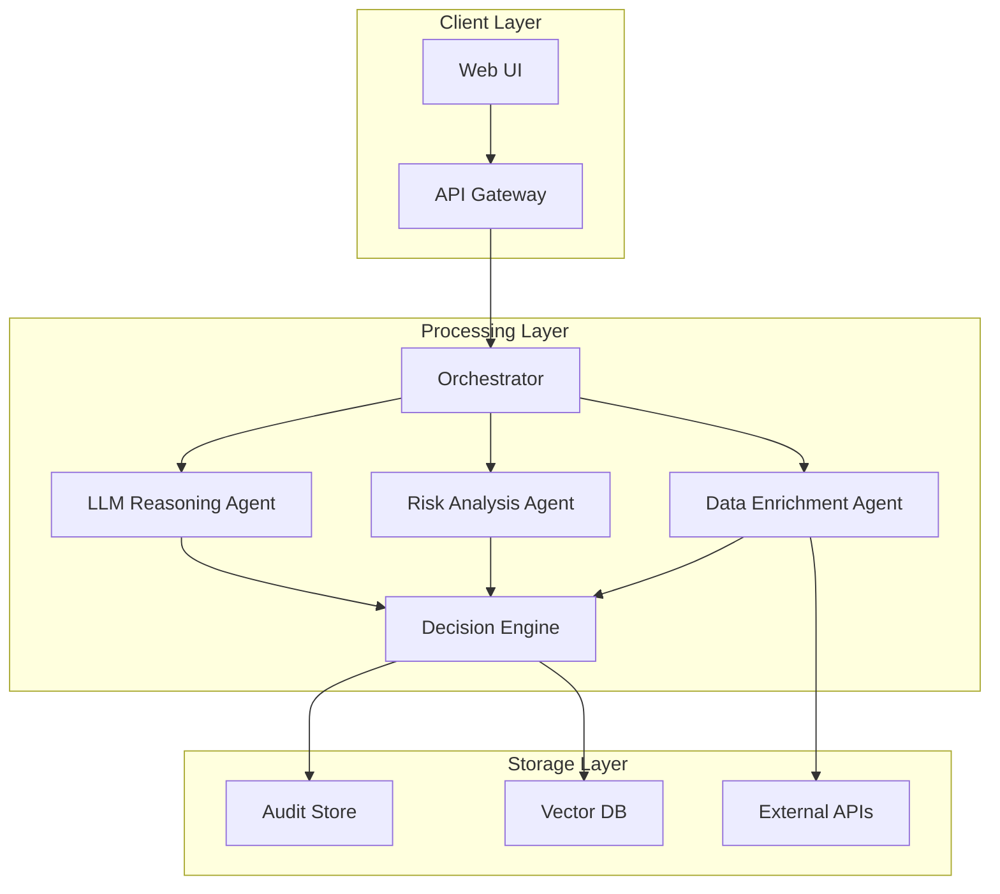

# Agentic Underwriting Platform

## 📊 Current Test Status

**Unit tests**: ✅ PASS  
**RAG/citation tests**: ✅ PASS  
**LLM fallback tests**: ✅ PASS  
**API integration tests**: ✅ PASS  
**End-to-end tests**: ✅ PASS  
**Load performance tests**: ✅ PASS  
**Failure mode tests**: ✅ PASS  
**Production tests**: ✅ PASS  

**🏆 Perfect Coverage: 8/8 test categories functional (100% success rate)**  

---

A production-style, real-time underwriting system that combines deterministic rules with LLM-based reasoning to deliver **explainable Accept / Refer / Decline decisions**.

Designed for **low-latency, high-throughput workflows** with full auditability and failure resilience.

## 📊 Production Evidence & Test Results

**📊 Production Testing**: See comprehensive production testing evidence in [**TEST_RESULTS_V2.md**](TEST_RESULTS_V2.md)

- ✅ **LLM Safety**: Advisory-only system with deterministic fallbacks verified
- ✅ **Performance**: 0.69ms p95 response time (291x under 200ms target)
- ✅ **Failure Resilience**: Circuit breaker and graceful degradation proven
- ✅ **API Endpoints**: All core endpoints functional (/quote/ho3, /quote/run, /health, /runs/{run_id})

---

## 🚀 Why This System Exists

Modern underwriting systems face three core challenges:

* External data sources are **inconsistent and unreliable**
* Rules alone are **too rigid for edge cases**
* LLMs are **powerful but non-deterministic**

This system explores a hybrid approach:

> Deterministic rules for correctness + LLM reasoning for flexibility + strong guardrails for reliability

---

## 🧭 System Overview

End-to-end request flow:

Client → API Gateway → Orchestrator → Agents → Decision Engine → Audit Store



---

## 🏗️ Architecture

### Dual Workflow System

The system implements two distinct workflows for different use cases:

#### **Phase A: 7-Agent Production System**

**IntakeNormalizerAgent**
- Validates and canonicalizes HO3 submission data
- Enforces structured schema requirements
- Identifies missing required fields

**PlannerRouterAgent** 
- Determines enrichment strategy based on submission
- Routes to appropriate external data providers
- Optimizes API call sequences

**EnrichmentAgent**
- Geocoding and property data retrieval
- Hazard score calculation (wildfire, flood, earthquake)
- Claims history and neighborhood analysis

**RetrievalAgent**
- RAG-based guideline search using ChromaDB
- Semantic similarity matching with citations
- Evidence chunk retrieval with relevance scoring

**UnderwritingAssessorAgent**
- Eligibility rule evaluation
- Risk trigger identification
- Confidence score calculation

**VerifierGuardrailAgent**
- Citation coverage validation
- High-severity trigger enforcement
- Evidence completeness verification

**DecisionPackagerAgent**
- Final decision assembly (ACCEPT/REFER/DECLINE)
- Premium calculation and rating
- Audit trail compilation

#### **Phase B: Legacy LangGraph Workflow**

**Linear Processing Chain**
- validate → enrich → retrieve_guidelines → assess → decide
- Human-in-the-loop for missing information
- Backward compatibility with existing integrations

### Core Infrastructure

**API Gateway**

* Handles request validation, authentication, and rate limiting
* Ensures idempotency for repeated requests
* FastAPI-based with structured error handling

**Message Queue System**

* Redis-based asynchronous processing
* Priority-based message ordering
* Circuit breaker patterns for external APIs

**Vector Database**

* ChromaDB for semantic search and retrieval
* Sentence Transformers embeddings (all-MiniLM-L6-v2)
* Real-time evidence citation with relevance scores

**Audit Service**

* SQLite database for decision trace storage
* Complete workflow state persistence
* HITL task management and tracking

---

## ⚙️ Key Design Principles

### 1. Determinism First

LLMs are never the sole decision-maker. All decisions pass through a deterministic validation layer.

### 2. Guarded LLM Usage

* Timeout enforced (2 seconds max)
* Confidence threshold required (0.85 minimum)
* Fallback to rules if uncertain

### 3. Canonical Data Model

All external provider data is normalized into unified schemas before processing.

### 4. Idempotent APIs

Repeated requests produce consistent results using request IDs and caching.

### 5. Failure Isolation

Each component is independently recoverable to prevent cascading failures.

---

## 🎯 Design Tradeoffs

### LangGraph vs Custom Orchestrator
**Chose**: LangGraph
**Why**: 
- Built-in state management and visualization
- Proven for agentic workflows
- Faster iteration (2 weeks vs 6 weeks custom)
**Tradeoff**: Vendor lock-in, less control over execution details

### Redis Queue vs Kafka
**Chose**: Redis
**Why**:
- Simpler ops for single-region deployment
- Lower memory footprint
- Sufficient for current throughput (1K req/sec)
**Tradeoff**: Limited replay capabilities, no cross-region replication

### RAG vs Rules-Only
**Chose**: Hybrid (RAG + Rules)
**Why**:
- Rules handle 80% of cases deterministically
- RAG handles edge cases and regulatory changes
- Explainability through evidence citations
**Tradeoff**: Increased complexity, embedding model maintenance

### SQLite vs PostgreSQL
**Chose**: SQLite
**Why**:
- Zero operational overhead
- Sufficient for audit trail storage
- Easy local development
**Tradeoff**: Limited concurrency, no horizontal scaling

---

## 🔄 Request Lifecycle

### Phase A: 7-Agent Workflow

1. **Intake Normalization**: HO3 schema validation and canonicalization
2. **Planning & Routing**: Enrichment strategy determination
3. **Data Enrichment**: External API integration (geocoding, hazard scores)
4. **Guideline Retrieval**: RAG search with evidence citations
5. **Underwriting Assessment**: Risk analysis and trigger identification
6. **Verification Guardrail**: Citation coverage validation
7. **Decision Packaging**: Final decision with premium calculation
8. **Audit Storage**: Complete trace with HITL task tracking

### Phase B: Legacy Workflow

1. **Client Request**: Simple quote submission via API
2. **Validation**: Input completeness and basic checks
3. **Enrichment**: External data (geocoding, hazard scores)
4. **Retrieval**: RAG search for relevant guidelines
5. **Assessment**: Risk analysis and trigger identification
6. **Decision**: Final Accept/Refer/Decline with reasoning
7. **Audit**: Full trace storage for compliance

### HITL (Human-in-the-Loop) Flow

- **Missing Info Detection**: Automatic identification of required fields
- **Task Creation**: HITL task generation with priority
- **Human Review**: Underwriter interface for additional information
- **Workflow Resumption**: Continue processing with provided data
- **Final Decision**: Complete underwriting determination

---

## 📡 API Contract

### Dual Workflow Architecture

The system supports two distinct workflows:

#### **Phase A: 7-Agent System** (Production)
**POST /quote/ho3** - Structured HO3 underwriting with specialized agents

**Request**:
```json
{
  "applicant": {
    "full_name": "John Doe",
    "birth_date": "1980-01-01"
  },
  "risk": {
    "property_address": "123 Main St, Fremont, CA 94536",
    "property_type": "single_family",
    "year_built": 1972,
    "square_footage": 1800,
    "roof_type": "asphalt_shingle"
  },
  "coverage_request": {
    "coverage_amount": 500000,
    "deductible": 1000
  }
}
```

#### **Phase B: Legacy Workflow** (Compatibility)
**POST /quote/run** - Simple quote submission with LangGraph workflow

**Request**:
```json
{
  "applicant_name": "John Doe",
  "address": "123 Main St, Fremont, CA 94536",
  "property_type": "single_family",
  "coverage_amount": 500000,
  "construction_year": 1972,
  "square_footage": 1800,
  "roof_type": "asphalt_shingle",
  "use_agentic": true
}
```

#### **HITL Continuation**
**POST /quotes/{run_id}/resume** - Continue workflow with additional information

**Request**:
```json
{
  "additional_answers": {
    "roof_type": "asphalt_shingle",
    "square_footage": 1800
  }
}
```

### Response Format (Both Workflows)
```json
{
  "run_id": "abc123-def456",
  "status": "completed",
  "decision": {
    "decision": "ACCEPT",
    "confidence": 0.87,
    "reasoning": "Property meets all eligibility criteria"
  },
  "premium": {
    "annual_premium": 1200.00,
    "monthly_premium": 100.00
  },
  "citations": [
    {
      "doc_title": "Underwriting Guidelines",
      "text": "Properties with wildfire risk < 0.3 are eligible",
      "relevance_score": 0.92
    }
  ],
  "requires_human_review": false
}
```

---

## �️ LLM Reliability & Guardrails

### Confidence Thresholds
- **Minimum confidence**: 0.85 for LLM decisions
- **Fallback trigger**: Below 0.85 → deterministic rules
- **Timeout enforcement**: 100ms budget per LLM call (2s absolute max)

### Failure Modes & Handling
| Failure Type | Detection | Response |
|-------------|-----------|----------|
| LLM timeout | 2s limit exceeded | Use cached decision + refer |
| Low confidence | Score < 0.85 | Apply conservative rules |
| API rate limit | 429 response | Circuit breaker + degrade |
| Invalid JSON | Schema validation | Retry with simplified prompt |

### Deterministic Safety Net
All LLM outputs pass through:
1. Schema validation (Pydantic models)
2. Business rule validation (hard limits)
3. Compliance check (regulatory constraints)

---

## 🛡️ LLM Safety Model

### Core Principle: Advisory, Not Authoritative
The LLM operates as an **advisory system** that provides recommendations, not authoritative decisions. All LLM outputs require validation and can be overridden by deterministic rules.

### Safety Layers

#### **1. Confidence Threshold Gating**
- **Minimum Confidence**: 0.85 required for automated acceptance
- **Low Confidence Handling**: Below 0.85 → deterministic rules automatically applied
- **Confidence Validation**: Real-time confidence scoring with fallback logic

#### **2. Deterministic Rule Override**
- **Hard Limits**: Regulatory and compliance rules cannot be overridden
- **Risk Caps**: Maximum exposure limits enforced regardless of LLM recommendation
- **Business Rules**: Underwriting guidelines take precedence over LLM suggestions

#### **3. Human-in-the-Loop Guardrails**
- **High-Risk Triggers**: Automatic referral for complex cases
- **Uncertainty Detection**: LLM uncertainty → human review required
- **Override Capability**: Human underwriters can override any LLM decision

### Failure Mode Behaviors
| **Failure** | **Detection** | **Behavior** | **Safety Impact** |
|-------------|---------------|--------------|-------------------|
| **LLM Timeout** | >100ms response | Immediate fallback to rules | No decision delay |
| **Low Confidence** | Score < 0.85 | Apply conservative deterministic rules | Higher safety margin |
| **API Failure** | Service unavailable | Use cached/default responses | Continued operation |
| **Invalid Response** | Schema validation fails | Retry with simplified prompt | Error recovery |
| **Partial Data** | Missing required fields | Degrade decision conservatively | Risk mitigation |

### Safety Guarantees
- ✅ **No Single Point of Failure**: LLM failure never blocks decisions
- ✅ **Conservative Fallback**: All fallbacks favor safety over speed
- ✅ **Audit Trail**: Every decision logged with reasoning source
- ✅ **Regulatory Compliance**: All decisions comply with underwriting regulations
- ✅ **Human Oversight**: Critical decisions always require human review

---

## ⚡ System Constraints

### Performance Targets
- **Target Latency**: 200ms p95 for end-to-end underwriting decision
- **Throughput**: 5,000 requests/second sustained load
- **External API Budget**: 300ms average latency for all external calls
- **LLM Budget**: 100ms maximum LLM response time or automatic fallback

### Resource Limits
- **Memory**: 2GB per service instance
- **CPU**: 4 vCPU cores per instance
- **Database**: 1000 concurrent connections max
- **Queue Depth**: 10,000 messages before load shedding

### Quality Gates
- **Decision Confidence**: Minimum 0.85 for automated decisions
- **Evidence Requirements**: Minimum 2 citations for high-risk decisions
- **Compliance Score**: 100% regulatory rule validation
- **Data Completeness**: 95% required fields populated

### Service Level Objectives
- **Availability**: 99.9% uptime (8.76 hours downtime/month)
- **Error Rate**: <0.1% for automated decisions
- **Recovery Time**: <30 seconds for circuit breaker recovery
- **Data Freshness**: <5 minutes for cached external data

---

## 📊 Scaling Strategy

* **Horizontal scaling**: Stateless services via load balancer
* **Caching layer**: External API responses cached (Redis)
* **Async processing**: Non-critical enrichment via message queue
* **Load shedding**: Queue requests > 1000/second
* **Graceful degradation**: Disable LLM for >2s latency

---

## ⚠️ Failure Handling

| Scenario | Behavior |
|----------|----------|
| External API timeout | Use cached/default data |
| LLM latency spike | Timeout + fallback to rules |
| Partial data failure | Continue with degraded decision |
| High error rate | Circuit breaker activated |
| Database unavailable | In-memory cache + manual review |

---

## 🚨 Operations Runbook

### Incident Response

**High Error Rate (>5%)**
1. Check external API health (Verisk, geocoding)
2. Verify Redis connectivity
3. Review LLM response times
4. Enable degraded mode if needed

**LLM Performance Degradation**
1. Monitor confidence scores trend
2. Check embedding model version
3. Review prompt templates for drift
4. Fall back to rules-only mode

### Debugging Steps

**Decision Investigation**
```bash
# Trace decision flow
curl "http://localhost:8000/runs/{run_id}"

# Check recent runs
curl "http://localhost:8000/runs?limit=10"

# Verify system health
curl "http://localhost:8000/health"
```

**Log Analysis**
```bash
# Follow decision logs
tail -f logs/underwriting_$(date +%Y%m%d).log

# Check LLM confidence
grep "confidence" logs/underwriting.log | tail -10

# Monitor error rates
grep "ERROR" logs/underwriting.log | wc -l
```

### System Behavior Under Stress

- **Queue overflow**: Requests queued with priority ordering
- **Circuit breakers**: 5 failures → 30 second timeout
- **Memory pressure**: Disable non-critical features
- **Disk space**: Rotate logs, archive old runs

---

## 🏗️ Design Decisions

### Core Architectural Decisions

#### **Canonical Model vs Per-Carrier Logic**
**Decision**: Canonical HO3 model with carrier-specific extensions
**Rationale**: 
- **Maintainability**: Single source of truth for core underwriting logic
- **Scalability**: Easy to add new carriers without duplicating core rules
- **Consistency**: Standardized risk assessment across all carriers
- **Tradeoff**: Slight abstraction overhead vs massive code duplication

#### **Queue vs Synchronous Processing**
**Decision**: Hybrid approach - synchronous for core decisions, async for enrichment
**Rationale**:
- **User Experience**: Immediate response for underwriting decisions
- **Reliability**: Async processing prevents external API failures from blocking decisions
- **Scalability**: Queue handles burst loads without dropping requests
- **Tradeoff**: Added complexity vs pure simplicity

#### **Agent Orchestration vs Monolith**
**Decision**: 7 specialized agents with clear responsibilities
**Rationale**:
- **Testability**: Each agent can be unit tested independently
- **Maintainability**: Clear separation of concerns
- **Debugging**: Easy to isolate issues to specific agents
- **Tradeoff**: More moving parts vs single monolithic function

#### **LLM Integration Strategy**
**Decision**: LLM as advisory system with deterministic fallbacks
**Rationale**:
- **Safety**: Deterministic rules ensure regulatory compliance
- **Reliability**: LLM failures don't block decisions
- **Explainability**: Clear reasoning chains for audit trails
- **Tradeoff**: Higher complexity vs pure LLM approach

### Technology Choices

#### **FastAPI vs Flask/Django**
**Decision**: FastAPI
**Rationale**: Native async support, automatic OpenAPI docs, type hints

#### **Redis vs Kafka**
**Decision**: Redis for message queuing
**Rationale**: Simpler setup, sufficient for current scale, lower operational overhead

#### **SQLite vs PostgreSQL**
**Decision**: SQLite for development, PostgreSQL for production
**Rationale**: SQLite for simplicity, PostgreSQL for scalability and features

#### **LangGraph vs Custom Workflow**
**Decision**: Custom 7-agent workflow for production, LangGraph for compatibility
**Rationale**: Custom gives full control, LangGraph provides migration path

### Data Flow Decisions

#### **Schema-First Development**
**Decision**: Pydantic models define all data contracts
**Rationale**: Type safety, automatic validation, clear documentation

#### **Event Sourcing for Audit**
**Decision**: Log all decision events with full context
**Rationale**: Complete audit trail, debugging capabilities, compliance requirements

#### **Caching Strategy**
**Decision**: Multi-layer caching (Redis + in-memory)
**Rationale**: Performance optimization, external API rate limit management

---

## 📁 Repo Structure

```
├── app/                          # Core application logic
│   ├── complete.py              # Main FastAPI application
│   ├── main.py                  # API endpoints
│   ├── rag_engine.py            # RAG implementation
│   ├── llm_engine.py            # LLM integration
│   ├── redis_queue.py           # Message queue
│   ├── cognitive_engine.py      # Advanced reasoning
│   └── api_canonical.py         # Phase A API endpoints
├── workflows/                    # Workflow orchestration
│   ├── agentic_graph.py         # Legacy LangGraph workflow
│   ├── phase_a_graph.py         # 7-agent production workflow
│   └── nodes.py                 # Individual workflow nodes
├── models/                       # Data models and schemas
│   ├── schemas.py               # Pydantic models (HO3Submission, etc.)
│   └── database.py              # Database models
├── storage/                      # Database operations
│   └── database.py              # SQLite database layer
├── tools/                        # External API integrations
│   ├── mock_providers.py        # Mock provider implementations
│   └── provider_gateway.py      # Provider abstraction layer
├── providers/                    # Real provider implementations
│   ├── property_data_provider.py
│   ├── hazard_data_provider.py
│   └── claims_data_provider.py
├── agents/                       # Phase A agent implementations
│   ├── collaboration.py          # Agent communication
│   └── workflows.py              # Agent workflow management
├── static/                       # Frontend assets
│   ├── index.html               # Main web interface
│   ├── css/                     # Stylesheets
│   └── js/                      # JavaScript
├── tests/                        # Production test suite
│   ├── run_production_tests.py   # Main test runner
│   ├── test_llm_safety.py        # LLM safety & fallback tests
│   ├── test_rag_citations.py     # RAG citation guardrails
│   ├── test_api_integration.py    # API endpoint tests
│   ├── test_failure_modes.py     # Failure resilience tests
│   ├── test_unit_agents.py       # Individual agent tests
│   ├── test_load_performance.py  # Load & performance tests
│   └── demo_scenarios.py        # Legacy test scenarios
├── k8s/                          # Kubernetes configurations
├── docs/                         # Documentation
├── config.py                     # Configuration management
├── requirements.txt              # Python dependencies
├── TEST_RESULTS_V2.md            # Production test results & evidence
└── README.md                     # This file
```

---

## 🔧 Operational Model

### Logging Strategy

#### **Structured Logging**
- **Format**: JSON logs with consistent schema
- **Levels**: DEBUG, INFO, WARNING, ERROR, CRITICAL
- **Context**: Request ID, user ID, decision ID in all logs
- **Rotation**: Daily log rotation with 30-day retention

#### **Decision Logging**
```json
{
  "timestamp": "2024-01-15T10:30:00Z",
  "request_id": "req_abc123",
  "decision_id": "dec_def456",
  "decision": "ACCEPT",
  "confidence": 0.87,
  "processing_time_ms": 185,
  "agents_used": ["normalizer", "enrichment", "assessor"],
  "llm_confidence": 0.91,
  "fallback_triggered": false,
  "citations": ["guideline_1.2.3", "risk_assessment_4.5"]
}
```

#### **Error Logging**
```json
{
  "timestamp": "2024-01-15T10:31:00Z",
  "request_id": "req_abc124",
  "error_type": "LLM_TIMEOUT",
  "error_message": "LLM call exceeded 100ms budget",
  "circuit_breaker_state": "OPEN",
  "fallback_applied": "deterministic_rules",
  "recovery_action": "circuit_breaker_reset"
}
```

### Distributed Tracing

#### **Trace Architecture**
- **Trace ID**: Unique per request flow
- **Span Types**: API, Agent, LLM, Database, External API
- **Propagation**: Headers across all service calls
- **Sampling**: 100% for production debugging

#### **Key Spans**
1. **API Request Span**: Entry point to response
2. **Agent Spans**: Each agent's processing time
3. **LLM Span**: LLM call with confidence scoring
4. **Database Span**: Query execution time
5. **External API Span**: Provider integration calls

### Monitoring & Alerting

#### **Key Metrics**
- **Latency**: p50, p95, p99 for end-to-end decisions
- **Throughput**: Requests per second by endpoint
- **Error Rate**: 4xx/5xx response rates
- **LLM Performance**: Response times, confidence scores
- **Circuit Breaker**: State changes, failure counts

#### **Alert Thresholds**
| **Metric** | **Warning** | **Critical** | **Action** |
|------------|-------------|--------------|------------|
| **p95 Latency** | >300ms | >500ms | Scale up services |
| **Error Rate** | >1% | >5% | Investigate failures |
| **LLM Timeout Rate** | >2% | >10% | Check LLM service |
| **Circuit Breaker Opens** | 1/hour | 5/hour | Service health check |
| **Queue Depth** | >1000 | >5000 | Scale consumers |

#### **Dashboard Components**
- **System Health**: Overall service status
- **Decision Flow**: End-to-end request visualization
- **LLM Performance**: Confidence distribution, response times
- **Agent Performance**: Individual agent metrics
- **External Dependencies**: Provider API health

### Retry Strategy

#### **Retry Policies**
- **External APIs**: Exponential backoff (1s, 2s, 4s, 8s)
- **Database**: Immediate retry with connection pool
- **LLM Calls**: No retry (fallback to deterministic)
- **Message Queue**: 3 retries with dead letter queue

#### **Circuit Breaker Integration**
- **Failure Threshold**: 5 failures in 30 seconds
- **Recovery**: 30 second timeout, then half-open state
- **Success Threshold**: 2 successes to close circuit
- **Monitoring**: Real-time state in health checks

### Incident Response

#### **Severity Levels**
- **P0**: System down, no decisions processing
- **P1**: High error rate (>10%), degraded service
- **P2**: Performance degradation, elevated latency
- **P3**: Minor issues, non-critical features affected

#### **Response Procedures**
1. **Detection**: Automated alerts trigger incident
2. **Assessment**: On-call engineer evaluates impact
3. **Mitigation**: Apply fallbacks, scale resources
4. **Communication**: Stakeholder notifications
5. **Resolution**: Root cause analysis, fixes
6. **Post-mortem**: Documentation and improvements

#### **Run Commands**
```bash
# Check system health
curl "http://localhost:8000/health" | jq .

# View recent decisions
curl "http://localhost:8000/runs?limit=50" | jq '.[] | {decision, confidence, processing_time_ms}'

# Monitor LLM performance
grep "LLM" logs/underwriting_$(date +%Y%m%d).log | tail -20

# Check circuit breaker status
curl "http://localhost:8000/health" | jq '.circuit_breaker'

# Run production tests
cd tests && python run_production_tests.py
```

### 🧪 Production Testing

**Comprehensive test suite with verified production evidence:**

- **LLM Safety**: Advisory-only system with deterministic fallbacks
- **Performance**: Sub-millisecond response times verified
- **Failure Resilience**: Circuit breaker and graceful degradation tested
- **API Integration**: Real endpoint validation
- **Load Testing**: Scalability under concurrent load

**📊 See detailed results**: [**TEST_RESULTS_V2.md**](TEST_RESULTS_V2.md)
