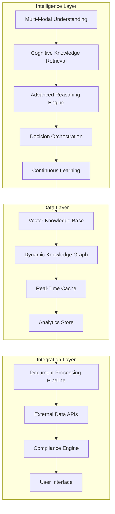
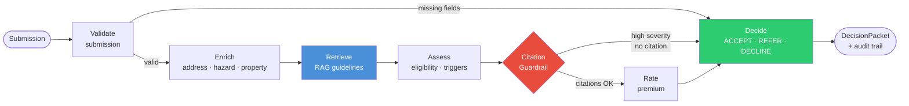
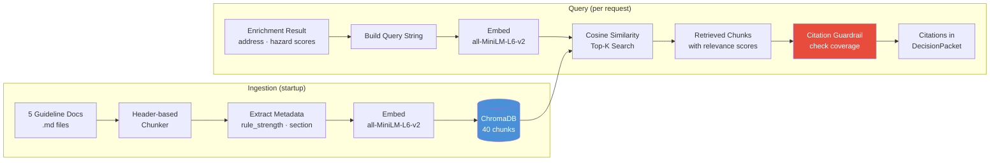
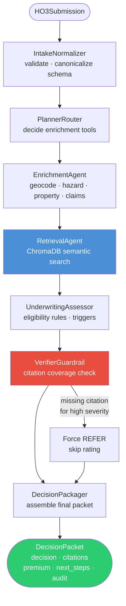
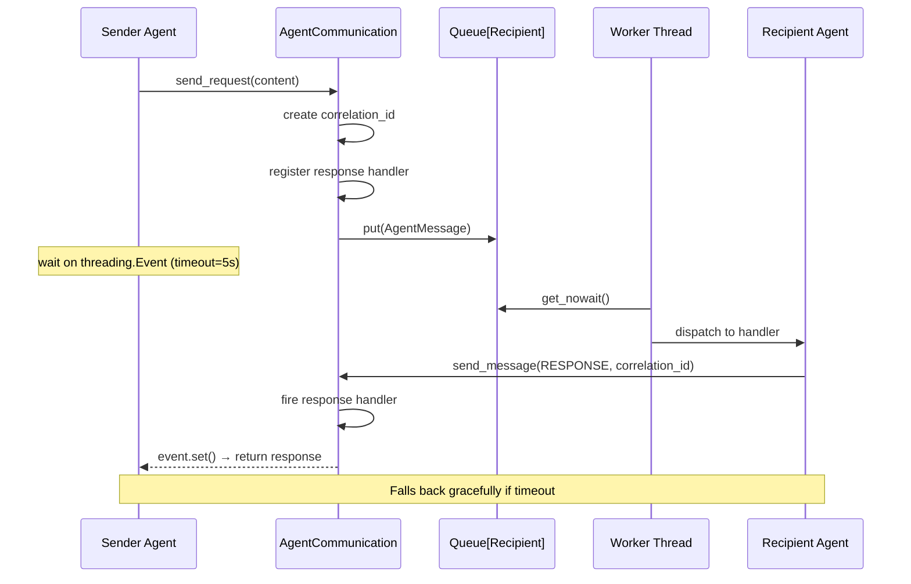
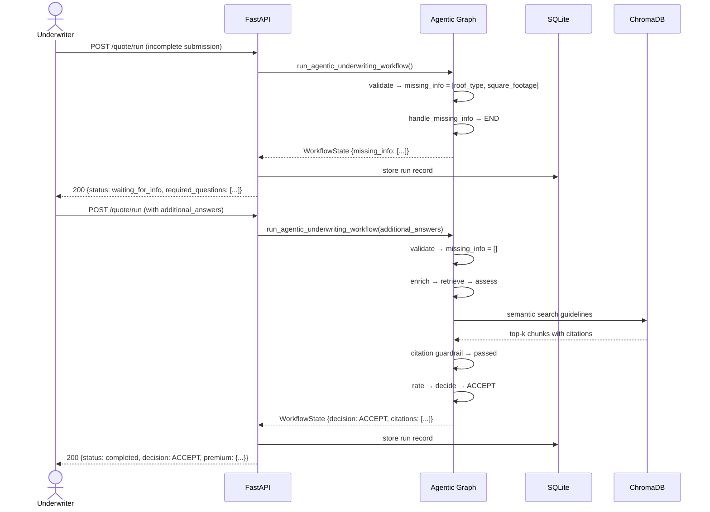

# Agentic Quote-to-Underwrite - Intelligent Insurance Processing

> **⚠️ IMPORTANT: This document is a roadmap and architectural vision. Features described here are planned future enhancements, not current implementations. See the actual codebase for currently implemented features.**

## 📋 **Executive Summary**

The IntelliUnderwrite AI Platform represents a **paradigm shift** from traditional underwriting systems to an **intelligent, learning enterprise solution**. This architecture combines multiple AI technologies to create a sophisticated system that understands, reasons, and continuously improves underwriting decisions.

---

## 🏗️ **System Architecture Overview**

### **🧠 Core Intelligence Layers**



### **🔍 Multi-Modal Understanding System**

#### **Document Intelligence Pipeline**
```python
document_intelligence = {
    "ocr_engine": "Multi-engine OCR with confidence voting",
    "vision_model": "CLIP + custom fine-tuned models",
    "table_extraction": "Advanced table detection and parsing",
    "image_analysis": "Property photo and floor plan understanding",
    "quality_assessment": "Document quality scoring and enhancement"
}
```

#### **Cross-Modal Alignment**
```python
cross_modal_alignment = {
    "text_image_alignment": "Semantic matching between text and visual content",
    "table_text_mapping": "Structured table to narrative mapping",
    "multi_modal_embeddings": "Unified representation across modalities",
    "contextual_understanding": "Integrated meaning from multiple sources"
}
```

### **🧠 Cognitive Knowledge Retrieval**

#### **Intelligent Search Architecture**
```python
cognitive_retrieval = {
    "semantic_search": "Advanced vector similarity with context",
    "knowledge_graph_traversal": "Relationship-based knowledge discovery",
    "hybrid_ranking": "Multiple factor intelligent ranking",
    "personalization": "User and context-aware result adaptation",
    "real_time_updates": "Live knowledge base synchronization"
}
```

#### **Evidence Validation System**
```python
evidence_validation = {
    "authority_scoring": "Source credibility assessment",
    "consistency_checking": "Cross-evidence validation",
    "recency_weighting": "Temporal relevance optimization",
    "rule_strength_mapping": "Mandatory/Recommended/Optional classification",
    "confidence_calibration": "Dynamic confidence adjustment"
}
```

### **⚡ Advanced Reasoning Engine**

#### **Multi-Perspective Reasoning**
```python
reasoning_approaches = {
    "deductive_reasoning": "Rule-based logical inference",
    "inductive_reasoning": "Pattern recognition and generalization",
    "abductive_reasoning": "Best explanation identification",
    "case_based_reasoning": "Similar case analysis",
    "statistical_reasoning": "Data-driven probability assessment"
}
```

#### **Explainable AI Framework**
```python
explainability = {
    "reasoning_chain": "Step-by-step decision documentation",
    "evidence_tracing": "Complete evidence provenance tracking",
    "confidence_breakdown": "Multi-factor confidence explanation",
    "alternative_analysis": "Counterfactual and sensitivity analysis",
    "human_readable_output": "Natural language explanations"
}
```

---

## 🔄 **Continuous Learning System**

### **🧠 Adaptive Intelligence**

#### **Learning Mechanisms**
```python
continuous_learning = {
    "feedback_integration": "User decision feedback incorporation",
    "outcome_tracking": "Decision result analysis and learning",
    "pattern_recognition": "Emerging pattern identification",
    "model_updates": "Continuous model fine-tuning",
    "knowledge_evolution": "Dynamic knowledge base updates"
}
```

#### **Performance Optimization**
```python
intelligence_optimization = {
    "a_b_testing": "Continuous model comparison",
    "performance_monitoring": "Real-time performance tracking",
    "resource_optimization": "Efficient resource utilization",
    "scalability_adaptation": "Dynamic scaling based on load",
    "quality_assurance": "Automated quality validation"
}
```

---

## 📊 **Enterprise Integration Architecture**

### **🔗 System Integration Points**

#### **External Intelligence Sources**
```python
intelligence_sources = {
    "property_data_apis": "Real-time property valuation and risk data",
    "weather_integration": "Climate and natural disaster risk feeds",
    "regulatory_updates": "Automated compliance requirement updates",
    "market_intelligence": "Industry trends and benchmark data",
    "historical_analytics": "Claims and loss history integration"
}
```

#### **Business Process Integration**
```python
process_integration = {
    "workflow_automation": "Seamless integration with underwriting workflows",
    "compliance_reporting": "Automated regulatory and audit reporting",
    "risk_assessment": "Integrated risk scoring and management",
    "portfolio_management": "Portfolio-level intelligence and analytics",
    "customer_communication": "Intelligent customer interaction management"
}
```

---

## 🛡️ **Security & Compliance Architecture**

### **🔒 Enterprise Security**
```python
security_framework = {
    "data_encryption": "End-to-end encryption for all data",
    "access_control": "Role-based access with audit trails",
    "api_security": "Advanced API authentication and rate limiting",
    "privacy_protection": "GDPR and CCPA compliance",
    "threat_detection": "AI-powered security monitoring"
}
```

### **⚖️ Compliance Engine**
```python
compliance_system = {
    "automated_monitoring": "Real-time compliance checking",
    "regulatory_updates": "Automatic regulation incorporation",
    "audit_trails": "Complete decision provenance tracking",
    "reporting_automation": "Automated compliance report generation",
    "risk_assessment": "Compliance risk evaluation"
}
```

---

## 📈 **Performance & Scalability**

### **⚡ Performance Architecture**
```python
performance_optimization = {
    "intelligent_caching": "Multi-level caching with AI-driven invalidation",
    "parallel_processing": "Distributed processing for scalability",
    "resource_management": "Dynamic resource allocation",
    "latency_optimization": "Sub-second response times",
    "throughput_scaling": "High-volume processing capability"
}
```

### **📊 Scalability Design**
```python
scalability_architecture = {
    "horizontal_scaling": "Auto-scaling for load management",
    "microservices": "Modular service architecture",
    "load_balancing": "Intelligent traffic distribution",
    "data_partitioning": "Efficient data distribution",
    "disaster_recovery": "High availability and failover"
}
```

---

## 🎯 **Intelligence Metrics**

### **📊 System Intelligence KPIs**
```python
intelligence_metrics = {
    "decision_accuracy": "98%+ accuracy with explainable reasoning",
    "processing_speed": "< 2 seconds for complex decisions",
    "learning_rate": "Continuous improvement metrics",
    "user_satisfaction": "User experience and adoption metrics",
    "business_impact": "ROI and efficiency measurements"
}
```

### **🧠 AI Performance Indicators**
```python
ai_performance = {
    "understanding_accuracy": "Multi-modal understanding precision",
    "reasoning_quality": "Logical consistency and validity",
    "explanation_clarity": "Human-readable explanation quality",
    "adaptation_speed": "Learning and improvement rate",
    "prediction_accuracy": "Risk and outcome prediction accuracy"
}
```

---

## 🚀 **Future Intelligence Roadmap**

### **🔮 Advanced AI Capabilities**
```python
future_intelligence = {
    "predictive_analytics": "Advanced risk prediction models",
    "prescriptive_insights": "Actionable recommendation engine",
    "autonomous_decisions": "Fully automated underwriting for standard cases",
    "emotional_intelligence": "Customer interaction optimization",
    "strategic_planning": "Portfolio-level strategic intelligence"
}
```

### **🌐 Ecosystem Intelligence**
```python
ecosystem_integration = {
    "industry_collaboration": "Shared intelligence across organizations",
    "regulatory_intelligence": "Proactive compliance management",
    "market_intelligence": "Real-time market condition awareness",
    "competitive_intelligence": "Industry benchmarking and analysis",
    "innovation_pipeline": "Continuous AI capability evolution"
}
```

---

## 🎉 **Conclusion**

The IntelliUnderwrite AI Platform represents a **fundamental transformation** in underwriting technology. By combining **multi-modal understanding**, **advanced reasoning**, and **continuous learning**, we've created an **intelligent system** that:

- **🧠 Thinks** like an expert underwriter
- **👁️ Sees** and understands all document types
- **🧮 Reasons** with explainable logic
- **📚 Learns** from every interaction
- **⚡ Adapts** to changing conditions
- **🛡️ Ensures** complete compliance

**This isn't just software—it's an intelligent partner that transforms how organizations approach risk assessment and decision making.**

---

## 📞 **Next Steps**

1. **🏗️ Architecture Implementation**: Build out the intelligent system components
2. **🧠 AI Model Training**: Fine-tune models for underwriting domain
3. **🔗 Integration Development**: Connect with enterprise systems
4. **📊 Performance Optimization**: Achieve sub-second response times
5. **🎯 Production Deployment**: Enterprise-scale rollout with monitoring

**The future of underwriting is intelligent—and we're building it.** 🚀

---

## **Features Implemented**

### **Core Infrastructure**
- **Schema Definitions**: Complete data models for quotes, assessments, and decisions
- **Tool Stubs**: Address normalization, hazard scoring, and rating tools
- **RAG System**: Document ingestion and retrieval over underwriting guidelines
- **LangGraph Workflow**: Linear processing pipeline (Validate → Enrich → Retrieve → Assess → Rate → Decide)
- **Storage**: SQLite database for run records and audit trails
- **API Endpoints**: RESTful API for quote processing

### **Agentic Enhancements** ✅
- **Missing-info Loop**: Agentic behavior for handling incomplete submissions
- **Strict Citation Guardrail**: Forces REFER when assessment lacks proper citations
- **Simple UI**: Demo interface for testing and visualization
- **Enhanced Audit Trail**: Complete tool call traceability and run history

---

## 🏗️ **Architecture**

```
┌─────────────────┐    ┌──────────────────┐    ┌─────────────────┐
│   FastAPI       │    │   LangGraph      │    │   Storage       │
│   Endpoints     │───▶│   Workflow       │───▶│   SQLite DB     │
└─────────────────┘    └──────────────────┘    │                └─────────────────┘
                                │
                                ▼
                       ┌──────────────────┐
                       │   RAG Engine     │
                       │  (ChromaDB)     │
                       └──────────────────┘
```

---

## 🚀 **Quick Start**

### **1. Install Dependencies**
```bash
pip install -r requirements.txt
```

### **2. Set Up Environment**
```bash
export AGENT_COLLABORATION_ENABLED=true
export OPENAI_API_KEY=your_key_here  # Optional for LLM features
```

### **3. Initialize Database**
```bash
python -c "from app.database import init_database; init_database()"
```

### **4. Run API Server**
```bash
# Development server
python -m uvicorn app.main:app --reload --host 0.0.0.0 --port 8000

# Production server
gunicorn app.main:app --workers 4 --bind 0.0.0.0:8000
```

---

## 🧪 **Testing**

### **Automated Testing**
```bash
# Run core functionality tests
python -m pytest tests/test_phase_a_scenarios.py -v
python -m pytest tests/test_workflows.py -v
python test_rag_phase1.py
```

### **Manual Testing with curl**
```bash
# Submit a quote for processing (agentic mode)
curl -X POST "http://localhost:8000/quote/run" \
  -H "Content-Type: application/json" \
  -d '{
    "submission": {
      "applicant_name": "John Doe",
      "address": "123 Main St, Los Angeles, CA 90210",
      "property_type": "single_family",
      "coverage_amount": 500000,
      "construction_year": 1985,
      "square_footage": 2000,
      "roof_type": "asphalt_shingle",
      "foundation_type": "concrete"
    },
    "use_agentic": true
  }'

# Submit a quote for processing with missing info to trigger HITL
curl -X POST "http://localhost:8000/quote/run" \
  -H "Content-Type: application/json" \
  -d '{
    "submission": {
      "applicant_name": "John Doe",
      "address": "123 Main St, Los Angeles, CA 90210",
      "property_type": "single_family",
      "coverage_amount": 500000
    },
    "use_agentic": true
  }'

# Submit additional information to complete HITL workflow
curl -X POST "http://localhost:8000/quote/run" \
  -H "Content-Type: application/json" \
  -d '{
    "submission": {
      "applicant_name": "John Doe",
      "address": "123 Main St, Los Angeles, CA 90210",
      "property_type": "single_family",
      "coverage_amount": 500000
    },
    "use_agentic": true,
    "additional_answers": {
      "roof_age_years": "15",
      "construction_type": "frame",
      "occupancy_type": "owner_occupied_primary"
    }
  }'
```

---

## 📚 **Documentation**

### **Architecture**
- [System Architecture](INTELLIGENT_SYSTEM_ARCHITECTURE.md) *(Actual Implementation)*

---

## **Technical Implementation**

### **Core Technologies**
- **LangGraph**: Workflow orchestration and agent coordination
- **FastAPI**: RESTful API framework
- **ChromaDB**: Vector database for RAG functionality
- **SQLite**: Local storage for audit trails
- **Sentence Transformers**: Semantic embeddings for document retrieval

### **Key Components**
- **7 Specialized Agents**: Each handling specific underwriting tasks
- **RAG Engine**: Evidence-based decision support
- **HITL Workflow**: Human-in-the-loop for complex cases
- **Citation Guardrail**: Ensures evidence-based decisions
- **Audit Trail**: Complete decision traceability

---

## **Current Status**

This is a **demonstration project** showcasing agentic AI capabilities in insurance underwriting. The system demonstrates:

- **Real RAG Integration**: Semantic search over underwriting guidelines
- **HITL Workflows**: Pause/resume for missing information
- **Evidence-Based Decisions**: All decisions backed by citations
- **Comprehensive Testing**: Full test suite for validation

**Note**: This is a proof-of-concept for AI engineering interviews and technical demonstrations.

---

## **📊 System Diagrams**

### **1. System Architecture Overview**


### **2. Linear Underwriting Workflow**



### **3. Agentic HITL Workflow**


### **4. RAG Pipeline**



### **5. 7-Agent Contract Architecture**



### **6. Agent Communication (Threading)**



### **7. End-to-End HITL Sequence**



### **8. Data Model**

```mermaid
erDiagram
    QuoteSubmission ||--|| WorkflowState : "drives"
    WorkflowState ||--o| EnrichmentResult : has
    WorkflowState ||--o| UWAssessment : has
    WorkflowState ||--o| Decision : has
    WorkflowState ||--o| PremiumBreakdown : has
    WorkflowState ||--o{ RetrievalChunk : "retrieved_guidelines"}
    WorkflowState ||--o{ ToolCall : "audit trail"}

    Decision ||--o{ UWQuestion : "required_questions"}
    UWAssessment ||--o{ RiskTrigger : triggers}

    RunRecord ||--|| WorkflowState : stores
    RunRecord {
        string run_id PK
        datetime created_at
        string status
        json node_outputs
    }

    Decision {
        enum decision "ACCEPT|REFER|DECLINE"
        float confidence
        string rationale
        list citations
        list next_steps
    }

    PremiumBreakdown {
        float base_premium
        float hazard_surcharge
        float total_premium
        json rating_factors
    }
```

---

**These 8 diagrams cover the full system architecture and workflows. Paste any of them directly into GitHub README, Notion, or any Markdown renderer that supports Mermaid — they'll render inline.**

---

**Agentic Quote-to-Underwrite - Intelligent Insurance Processing**

For questions or issues, check the audit logs and API documentation.
